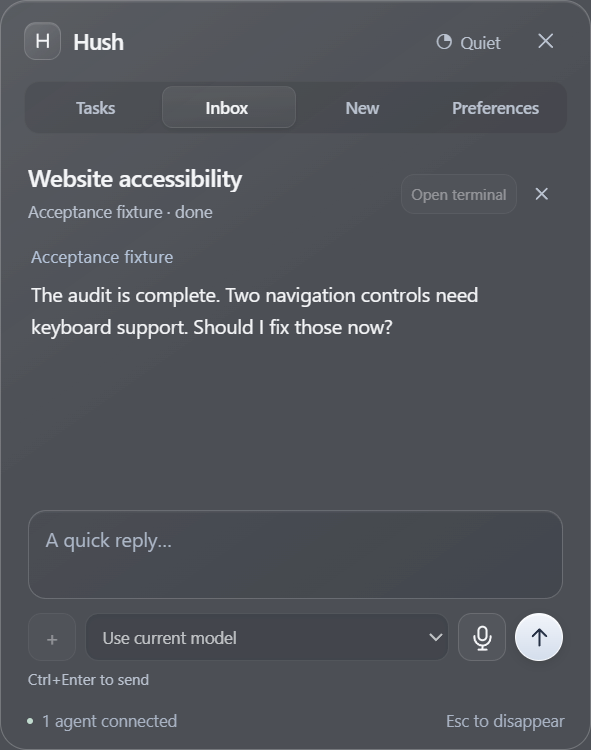
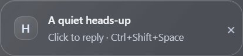

# Hush

**Reply to your coding agents without stopping what you are doing.**

Codex, Claude Code and Cursor run for minutes at a time and then wait for you. Hush puts them in one small panel in the corner of your screen, tells you quietly when one needs an answer, and takes your reply. Windows, macOS and Linux.



When an agent finishes or needs input, a cue appears for five seconds. It makes no sound and never takes focus, so whatever you were doing carries on.



Press **Ctrl+Shift+Space** from anywhere to open the panel, or click the cue. **Send & hide** puts it away again. **Escape** hides it and keeps your draft.

## What you need

- **Node 22 or newer.**
- **At least one agent CLI.** Codex is included with Hush and uses your existing Codex sign-in. [Claude Code](https://claude.com/claude-code) and the Cursor Agent CLI must be installed and signed in separately if you want those.

Nothing else. Hush creates no account, adds no subscription, and never asks for your password.

## Run it

```bash
git clone https://github.com/noetion/hush-agent
cd hush-agent
npm ci
npm start
```

That is the whole install. Because nothing arrives as a downloaded executable, no operating system warns about it, and `git pull` is how you update.

Hush opens its panel. Closing the panel minimizes it to the taskbar or Dock rather than quitting, so agents stay connected.

<details>
<summary>Packaged builds, and why the clone is easier</summary>

`npm run package` builds for whichever platform you run it on: a portable `.exe` on Windows, a `.dmg` on macOS, an `.AppImage` on Linux. None needs an installer or administrator access.

They are **not code-signed**, so Windows shows "Windows protected your PC" the first time and you have to choose **More info → Run anyway**; macOS and Linux object in their own ways. Signing needs a certificate tied to a real identity. Running from a clone sidesteps all of it.
</details>

## First steps

1. Open **Tasks** to find conversations you already have in Codex, Claude Code or Cursor.
2. Pick one and reply. For a Codex task that Codex still owns, keep Codex running: Hush queues your reply into that same task.
3. Or open **New** and start a fresh conversation. No project folder required.

## Agents it works with

| Connection | What works | Boundary |
|---|---|---|
| **Codex** | Replies and images to tasks the desktop app owns; new sessions also get model selection | Existing-task replies go through the official queue, so Codex keeps ownership. Approvals for those stay in Codex. |
| **Claude Code** | New and resumed sessions, images, model selection, per-tool permission decisions | Needs Claude Code installed and signed in. A conversation an open Claude Code window is already running is read-only here, because resuming it would write your reply into a transcript that window never sees. Reply there, or close it and reconnect. Conversations Hush starts are its own and reply normally. |
| **Cursor Agent CLI** | ACP conversations, images, live model selection | Needs the Cursor Agent CLI installed and signed in. Conversations created in the Cursor IDE cannot be reached: ACP only loads sessions under `~/.cursor/acp-sessions`, while IDE chats live in a separate store whose ids it rejects. That is a limit in Cursor, not an untested case. |
| **Herdr** | Find running local agents, read output, reply, focus them in Herdr | Needs `herdr` on `PATH` and its server running. Blocked terminal prompts are handled in Herdr. |
| **Grok Bot** | Not connected | Its agents run on xAI's cloud rather than as a local process, and no first-party interface for reading a bot's state and replying is documented. Nothing to attach to yet. |
| **Anything else** | A local bridge that accepts status and returns replies | You supply a small adapter. See [the bridge guide](docs/BRIDGE.md). |

**Open terminal** hands a finished session back to its own CLI in a new terminal window and releases Hush's hold on it. Hush names the terminal it could not find rather than failing silently.

## Dictation

The **microphone** button listens until you press Stop, adding each phrase to your draft as editable text. Speak as long as you like; pauses between sentences do not end it, and stopping finishes the phrase you are part-way through rather than dropping it.

Each platform uses the recognizer it already has, so there is no model to download and no subscription. Windows uses the one in the box. macOS 26 uses SpeechAnalyzer, on device. Linux has no system recognizer, so it records with `arecord`, `parecord` or `ffmpeg` and transcribes with a whisper.cpp CLI on `PATH` — set `HUSH_DICTATION_MODEL` to a model file, or `HUSH_DICTATION_CMD` to your own command. Where a piece is missing the button says which one on hover.

[Why it is built this way](docs/VOICE.md), including what was ruled out.

## Staying out of the way

Left alone, Hush fades to half opacity after two seconds and lets your clicks pass straight through to whatever is behind it. After five it rolls up to a single status bar and sinks further, since by then there is one line left and nothing to act on.


Moving onto it, typing, the shortcut, or an agent needing you brings it back. It never recedes while you are holding a draft, dictating, or have a decision waiting. Turn it off in Preferences if you would rather it stayed put.

- **Cue:** five seconds, no sound, no message preview, at most one every 15 seconds.
- **Quiet mode:** suppresses every popup until you turn it off; the tray still counts unread.
- **Placement:** any corner of the screen your pointer is on, or drag it where you like.
- **Games:** ordinary windows and borderless fullscreen work. Exclusive fullscreen can cover any desktop overlay. Hush does not inject into games or capture your screen to work around that.

## Your data

Preferences, session references, drafts and the local bridge file live in Hush's own profile directory: `%APPDATA%\Hush` on Windows, `~/Library/Application Support/Hush` on macOS, `~/.config/Hush` on Linux. Conversation text stays in memory for the run; the providers keep their own history.

Hush adds no analytics and no remote relay. Attached images stay local so queued replies can use them, and providers receive them only when you send.

## Develop

```bash
npm test              # unit tests
npm start             # run from source
npm run package       # build for this platform
```

`HUSH_DATA_DIR` selects an isolated profile; do not share one between simultaneous instances. `HUSH_CODEX_BIN` and `HUSH_CLAUDE_BIN` point at specific provider executables. If Electron's binary is missing after install, run `node node_modules/electron/install.js`.

The self-test boots the real app, drives its own windows, writes screenshots and results under `artifacts/`, then quits:

```bash
HUSH_SELF_TEST=1 HUSH_DATA_DIR="$PWD/artifacts/test-profile" npx electron .
```

On a headless Linux machine it needs both a display and a window manager, because a window with no window manager cannot be minimized and that is part of what it checks. See `.github/workflows/ci.yml` for the exact invocation.

Every pull request and every merge to `main` runs the unit tests, the self-test against the real app, a package build, and the channel exercised from that packaged build, on Windows, macOS and Linux. Day-to-day use so far has been on Windows, so treat macOS and Linux as working rather than worn in.

[What is verified and what is not](docs/VERIFICATION.md) is worth reading before trusting any of the above. There are also notes on [why Electron](docs/RESEARCH.md) and [the interface decisions](docs/DESIGN.md).

## Licence

[MIT](LICENSE). Use it, change it, ship it.
